# 01-Halo2入门基础介绍
B站视频链接见[这里](https://www.bilibili.com/video/BV1ML4y1M7iV/?spm_id_from=333.999.0.0&vd_source=c6586ed2410fae637f393017e00f4845)。下面是记录的笔记。
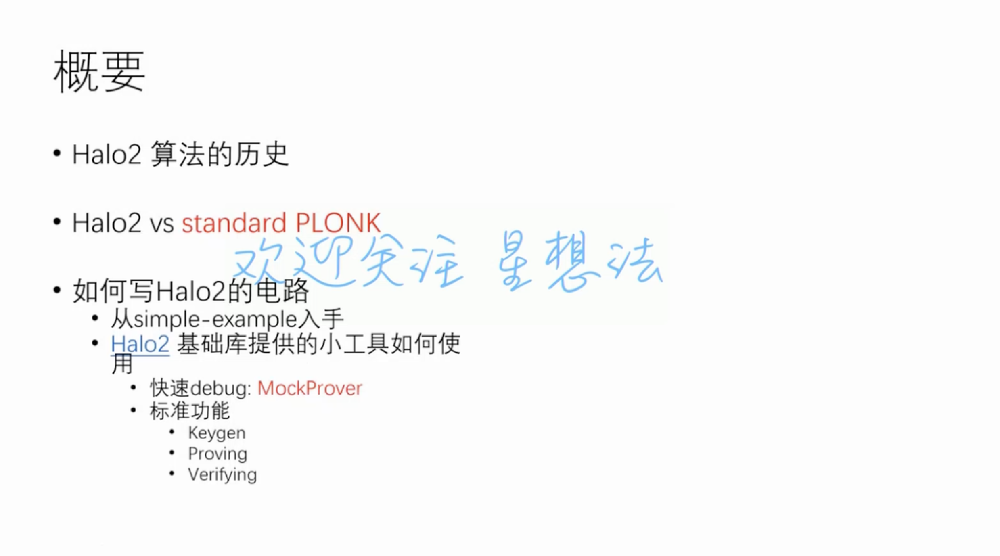
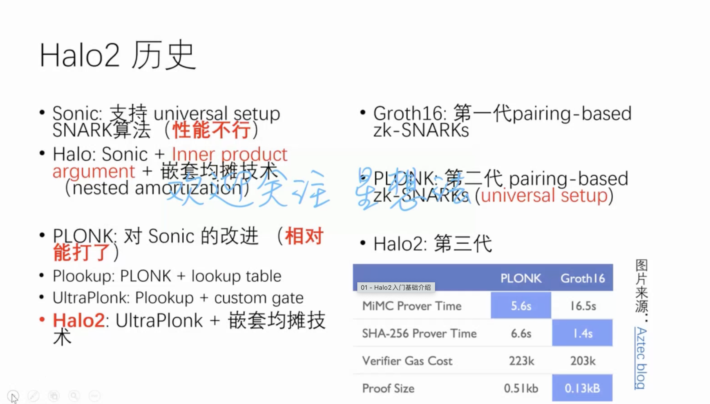
* Sonic的验证算法是线性的。
* Sonic里面的算法用的是KZG，而在Halo里面进行了替换，使用了内积证明，进一步将universal setup条件削弱了，不需要setup。
* Halo2
    * 不需要setup
    * 曲线不需要配对，普通离散对数曲线即可
    * 支持递归
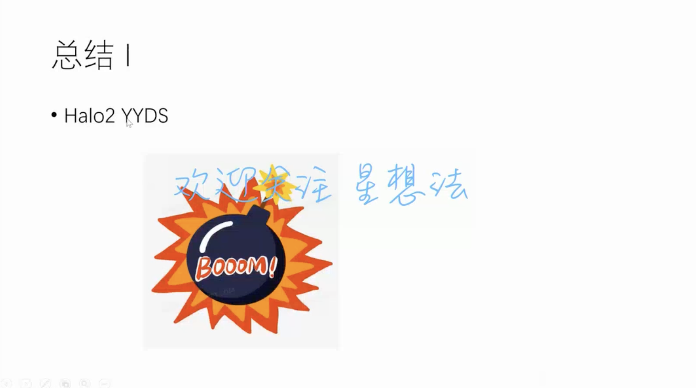
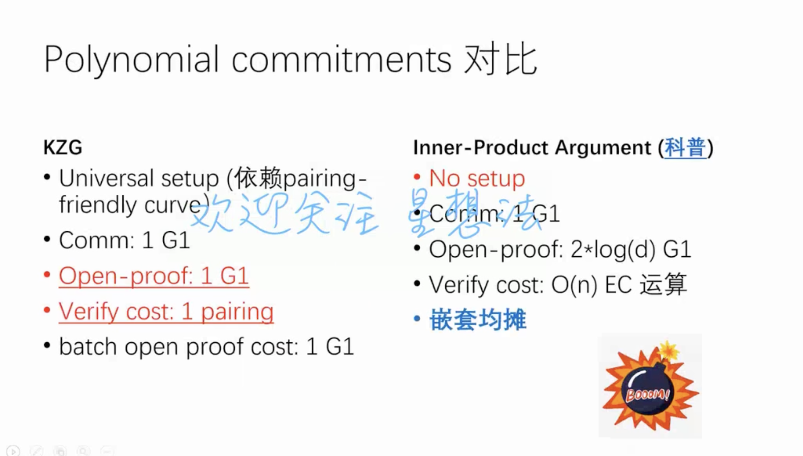

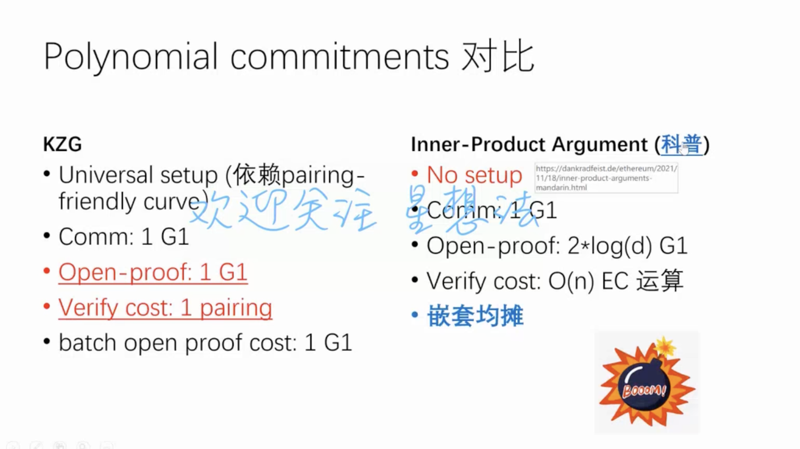

* 内积证明科普链接见[这里](https://dankradfeist.de/ethereum/2021/11/18/inner-product-arguments-mandarin.html) 。

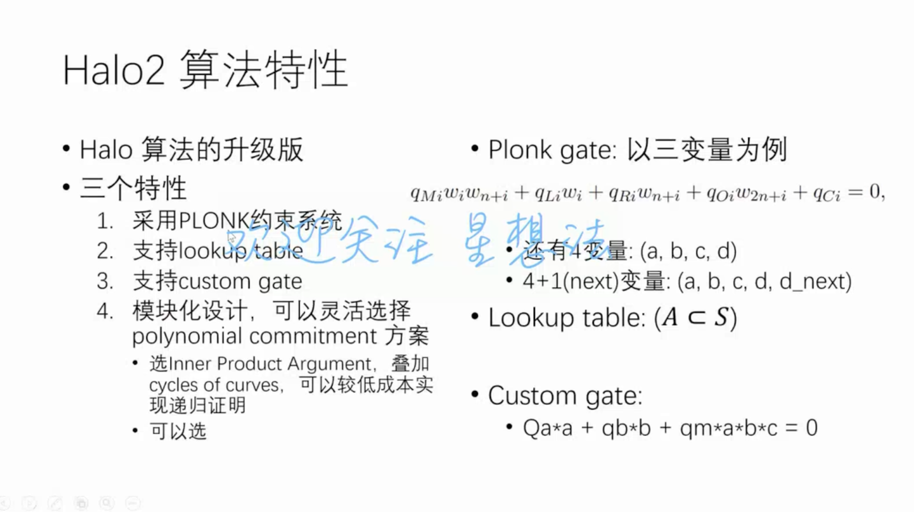
* 在Grouth16中一个很长的线性组合，在Plonk中可能会拆分成几十个gate约束。
* 在zkSync代码中会有标准Plonk的变种。
* 标准Plonk Gate是三元二次多项式，Custom gate可以作是多元多次多项式。
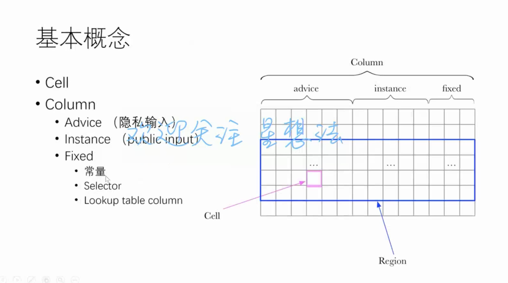
* Selector: 选择子，由于同一行支持几种不同的约束，可以通过选择子来设置满足几条约束。
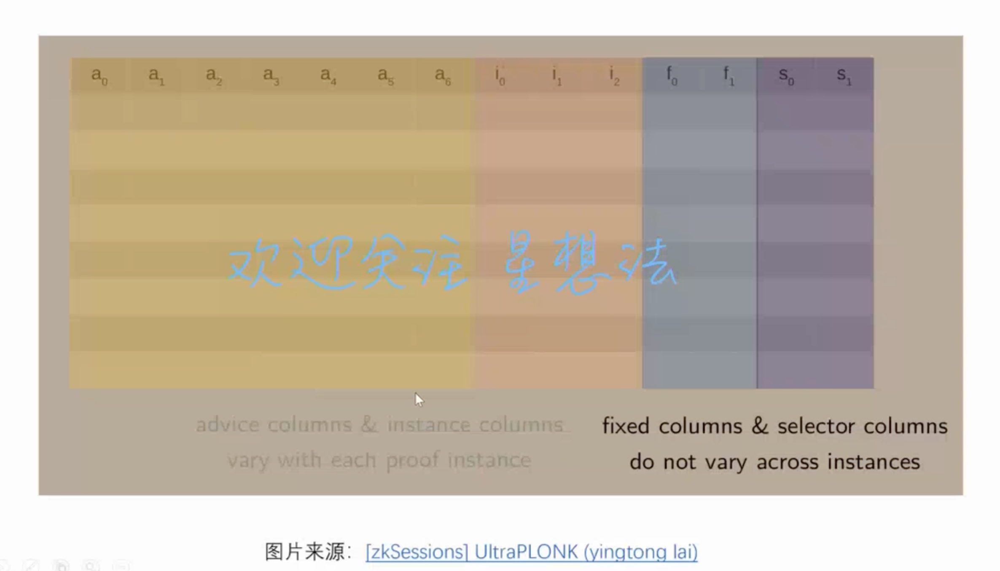
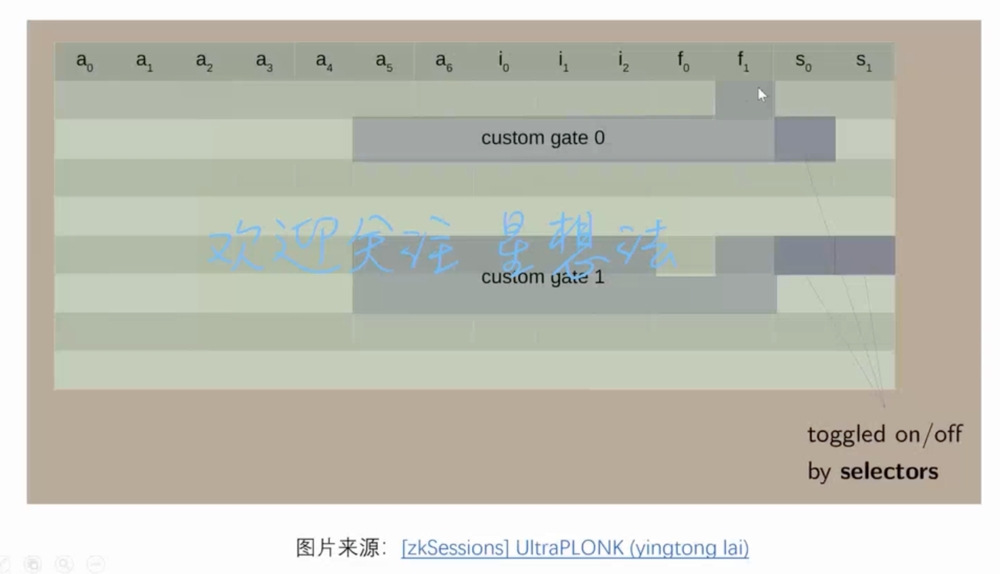
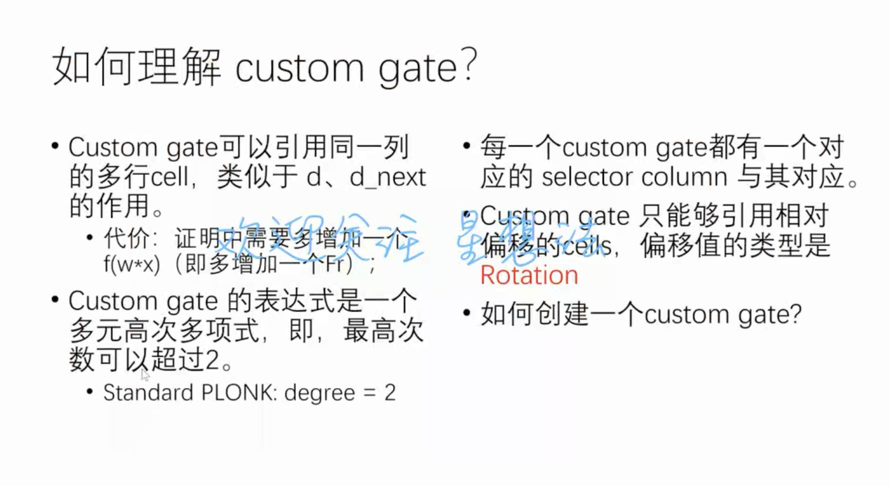
* Custom gate如果多项式次数很高的话，会增加商多项式，在Plonk协议中的第三步，会产生很多小的t多项式。 
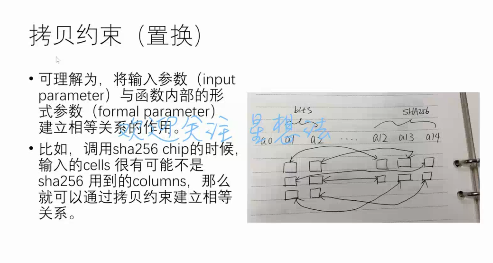
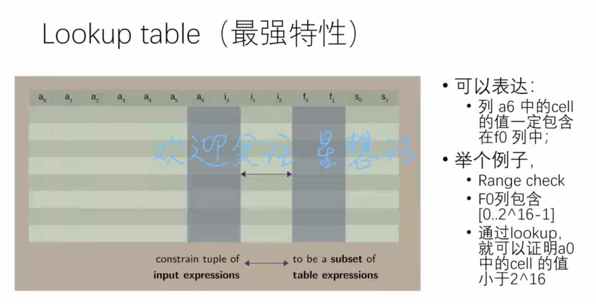
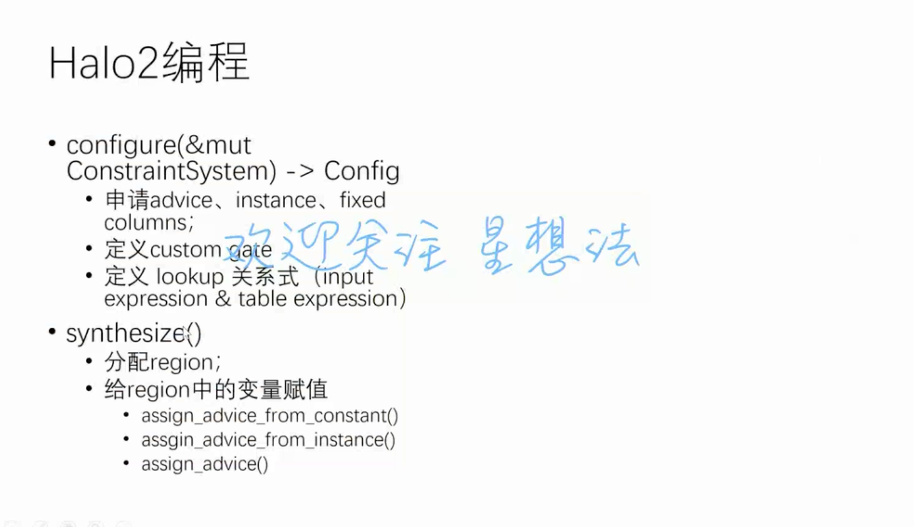